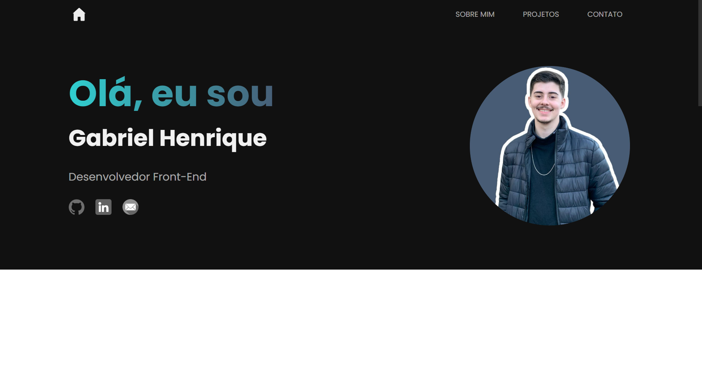

<h1 align="center"> Portfólio - Gabriel Henrique </h1>

Esse é o meu Portfólio, que inclui os meus principais projetos e tecnologias que utilizo.  

  <a href="#-tecnologias">Tecnologias</a>&nbsp;&nbsp;&nbsp;|&nbsp;&nbsp;&nbsp;
  <a href="#-projeto">Projeto</a>&nbsp;&nbsp;&nbsp;|&nbsp;&nbsp;&nbsp;
  <a href="#-contato">Contato</a>

 

  

## 🚀 Tecnologias

Esse projeto foi desenvolvido com as seguintes tecnologias:

- HTML
- CSS
- JavaScript
- jQuery
- Git e Github

## 💻 Projeto

- [Visite o projeto online](https://ghenriquev.github.io/portfolio)

# 📧 Contato
<a href = "mailto:gabriel.emv@hotmail.com">
 

